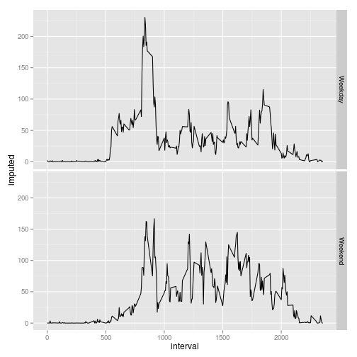

# Reproducible Research: Peer Assessment 1

## Loading and preprocessing the data

```r
options(scipen = 5, digits = 2)
```


```r
library("reshape2", quietly = TRUE)
library("Hmisc")
```

```
## Loading required package: grid
## Loading required package: lattice
## Loading required package: survival
## Loading required package: splines
## Loading required package: Formula
## 
## Attaching package: 'Hmisc'
## 
## The following objects are masked from 'package:base':
## 
##     format.pval, round.POSIXt, trunc.POSIXt, units
```

```r
library("ggplot2")
data <- read.csv(unz("activity.zip", "activity.csv"))
data2 <- subset(data, !is.na(data$steps))
```


## What is mean total number of steps taken per day?
The following figure is a histogram of the total number of steps per day.

```r
step_melt <- melt(data2, id.vars = "date", measure.vars = "steps")
step_sum <- dcast(step_melt, date ~ variable, sum)
with(step_sum, hist(steps, breaks = 10))
```

 

The mean number of steps per day is 10766.19 and the median 10765

## What is the average daily activity pattern?
The following plot is a time series plot of the 5-minute interval and the average number of steps taken, averaged across all days.


```r
interval_melt <- melt(data2, id.vars = "interval", measure.vars = "steps")
interval_mean <- dcast(interval_melt, interval ~ variable, mean)
plot(interval_mean$interval, interval_mean$steps, type = "l", main = "Average daily activity pattern")
```

 


The interval with the highest average number of steps is the interval with the id 835

## Imputing missing values
There are a total number of 2304 rows with missing values in the data. The NA's are imputed by taking the mean number of steps in the respective interval

```r
nas = which(is.na(data))
impute_vec <- sapply(nas, function(n) {
    interval_mean[interval_mean$interval == data[n, "interval"], "steps"]
})
data$imputed <- impute(data$steps, impute_vec)
```


The following figure shows a histogram of the total number of steps taken including the imputed values.


```r
step_melt <- melt(data, id.vars = "date", measure.vars = "imputed")
step_sum <- dcast(step_melt, date ~ variable, sum)
with(step_sum, hist(imputed, breaks = 10))
```

 

The mean number of steps per day is 10766.19 and the median 10766.19. There is no significant difference in mean or median when imputing missing values.

## Are there differences in activity patterns between weekdays and weekends?

This plot shows the activity patterns during weekdays and weekends.

```r
days <- weekdays(as.Date(data$date))
data$weekend <- as.factor(days == "Saturday" | days == "Sunday")
levels(data$weekend) <- c("Weekday", "Weekend")
wd_melt <- melt(data, id.vars = c("interval", "weekend"), measure.vars = "imputed")
wd_mean <- dcast(wd_melt, interval + weekend ~ variable, mean)
qplot(interval, imputed, data = wd_mean, facets = weekend ~ ., geom = "line")
```

 

These plots suggest that there is more activity on weekends than during the week between approximately 10 AM and 05 PM. One reason could be that during that time period more time is spent on outdoor activities during the weekend.
